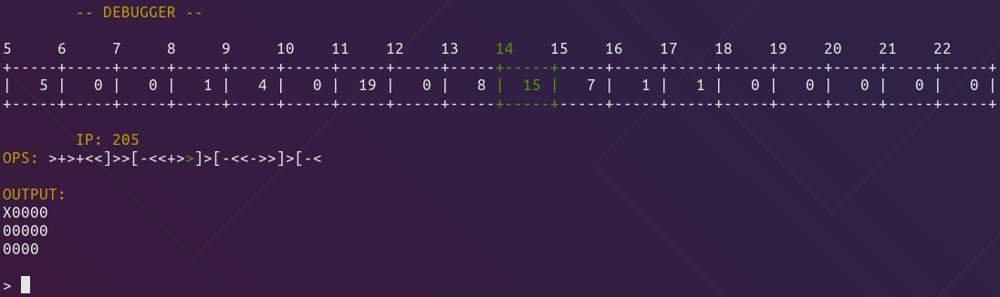

# BrainFuck_Debugger
A c++ debugger and interperter for [Brain Fuck](https://en.wikipedia.org/wiki/Brainfuck)

## How To Use (Linux)
```./brainfuck_debugger <args> <path_to_brainfuck_file>```

Use `-h` flag to see help


## Screenshot


## Scripts
### hw.bf
'Hello World!' program (literaly took it from the wiki page).

### clear_screen.bf
clears the screen.

### grid.bf
prints sequence of frames each of which is a grid of zeros with one 'X' that advances each frame.
